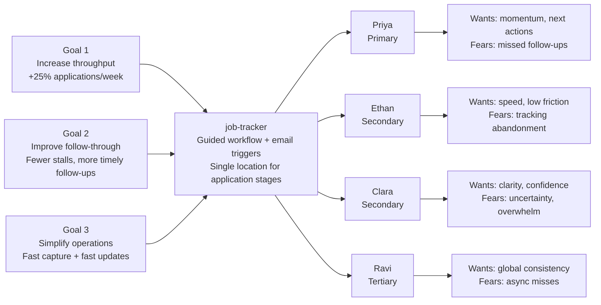

# Trigger Map Poster: job-tracker-planning

> Visual overview connecting business goals to user psychology

**Created:** 2026-03-26
**Author:** JC
**Methodology:** Based on Effect Mapping (Balic & Domingues), adapted for WDS framework

---

## Strategic Documents

This is the visual overview. For detailed documentation, see:

- [Feature Impact Analysis](./feature-impact-analysis.md)
- [Personas folder](./personas/)

---

## Vision

Help individual technical job seekers increase weekly application throughput by replacing fragmented tracking with a guided, centralized workflow that prompts the right next action at the right time.

---

## Business Objectives

### Objective 1: Increase job search throughput for users

- **Metric:** Applications per week
- **Target:** +25% sustained uplift from baseline
- **Timeline:** 6 months

### Objective 2: Improve user consistency and follow-through

- **Metric:** Follow-up completion and stalled-application reduction
- **Target:** 60% follow-ups completed within 24h; 30% fewer stalled applications
- **Timeline:** 6 months

### Objective 3: Make application management operationally simple

- **Metric:** Speed and consistency of capture/updates
- **Target:** 80% capture <2 min; 90% updates <15 sec
- **Timeline:** 6 months

---

## Target Groups (Prioritized)

### 1. Priya the Pipeline Optimizer

**Priority Reasoning:** Primary segment most aligned to the core metric (`applications/week +25%`) and the guided-workflow differentiator.

> Mid-career technical job seeker applying across multiple sources who needs clarity, momentum, and reliable follow-through.

**Key Positive Drivers:**
- Increase weekly application output without chaos
- Always know the next action per application
- Maintain momentum with low-friction updates

**Key Negative Drivers:**
- Losing track across tools
- Missing follow-ups due to manual gaps
- Spending too much time organizing instead of applying

### 2. Ethan the Efficient Explorer

**Priority Reasoning:** High potential volume user; strong fit for fast capture and lightweight workflow.

> Early-to-mid career technical candidate applying broadly and needing a fast, standardized tracking loop.

**Key Positive Drivers:**
- Capture opportunities quickly from many sources
- Reduce overhead per entry and update
- Keep motivation through visible progression

**Key Negative Drivers:**
- Entry friction causing abandonment
- Inconsistent status labeling
- Notification fatigue/noise

### 3. Clara the Career Changer

**Priority Reasoning:** Strong need for guided progression and confidence support, with slightly lower initial volume.

> Career-transition candidate entering technical roles who benefits from structure, prompts, and clear stage expectations.

**Key Positive Drivers:**
- Step-by-step clarity for unfamiliar stages
- Confidence from guided progression
- Reminders that reduce anxiety

**Key Negative Drivers:**
- Uncertainty after each stage
- Missed prep windows before interviews
- Overwhelm from fragmented tools

### 4. Ravi the Remote Reacher

**Priority Reasoning:** Strategic fit with global search vision; specialized needs can be tuned post-v1.

> Experienced technical candidate managing distributed, remote-first opportunities across time zones.

**Key Positive Drivers:**
- Track global applications in one place
- Maintain consistency across varied hiring processes
- Preserve full history for better decisions

**Key Negative Drivers:**
- Missing asynchronous recruiter windows
- Fragmented source tracking
- Process drift across long timelines

---

## Trigger Map Visualization

---

## Design Focus Statement

Prioritize features that reduce tracking friction and increase action reliability for the primary persona (Priya), while preserving enough simplicity for high-volume and transition users.

**Primary Design Target:** Priya the Pipeline Optimizer

**Must Address:**
- Next-action guidance at every stage
- Fast capture and update interactions
- Reliable email reminders for stage changes and stalled flow

**Should Address:**
- Quick filtering for high-volume applications
- Confidence-supporting content for transition users
- Time-zone-aware reminder behaviors for global applicants

---

## Cross-Group Patterns

### Shared Drivers

All groups value clarity on what to do next, low-friction status updates, and confidence that no opportunity is silently dropped.

### Unique Drivers

- Priya: throughput optimization and disciplined process
- Ethan: speed and low operational drag
- Clara: confidence and guided comprehension
- Ravi: consistency across global, asynchronous hiring patterns

### Potential Tensions

Over-notification can reduce trust for volume users while under-notification harms consistency for transition users. Notification tuning must be explicit and user-controllable.

---

## Next Steps

- [ ] Use [Feature Impact Analysis](./feature-impact-analysis.md) for implementation ordering
- [ ] Use persona files in [personas](./personas/) during UX scenario design
- [ ] Proceed to Phase 3 (`OS`) to convert map insights into journey scenarios

---

_Generated with Whiteport Design Studio framework_
